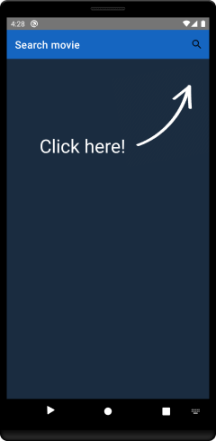

# OMDBSearch

Simple android app to uses OMDB API to look up movie data, store it in a local database, and display detailed movie info.

## Getting Started
This project uses the Gradle build system. To build this project, use the `gradlew build` command or use "Import Project" in Android Studio.

## Screenshots




### Prerequisites

You are going to need to get:
* [OMDB API Key](http://www.omdbapi.com/) - API Key used to retreive movie data

Once you've obtained a key, make sure you put it in the **APIKeys** class under the package **api**
```
 public static String APIKEY = "YOUR API";
```

### Installing

To clone this github repository, use

```
git clone https://github.com/strayckler/OMDBSearch.git
```

## Built With

* [Foundation][0] 
  * [AppCompat][1]
* [Architecture][10]
  * [LiveData][13]
  * [Navigation][14]
  * [Room][16]
  * [ViewModel][17]
* [UI][30]
  * [Fragment][34]
  * [Layout][35]
* Third party
  * [Picasso][90] for image loading

[0]: https://developer.android.com/jetpack/components
[1]: https://developer.android.com/topic/libraries/support-library/packages#v7-appcompat
[10]: https://developer.android.com/jetpack/arch/
[13]: https://developer.android.com/topic/libraries/architecture/livedata
[14]: https://developer.android.com/topic/libraries/architecture/navigation/
[16]: https://developer.android.com/topic/libraries/architecture/room
[17]: https://developer.android.com/topic/libraries/architecture/viewmodel
[30]: https://developer.android.com/guide/topics/ui
[34]: https://developer.android.com/guide/components/fragments
[35]: https://developer.android.com/guide/topics/ui/declaring-layout
[90]: https://bumptech.github.io/glide/

## Authors

* **Stefan Krstikj** - [strayckler](https://github.com/strayckler)

## License

This project is licensed under the MIT License

## Acknowledgments

* [Android Sunflower](https://github.com/android/sunflower)
